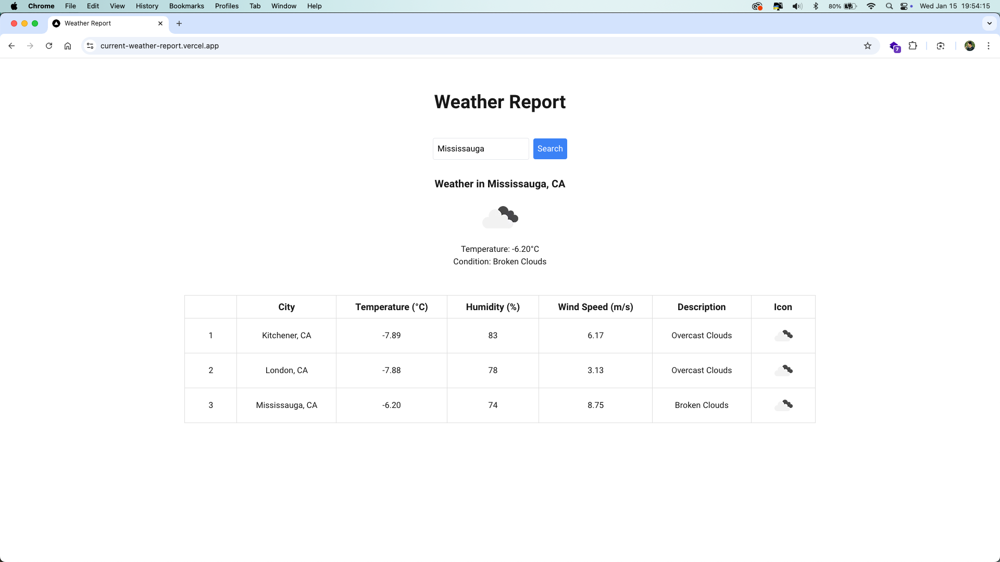
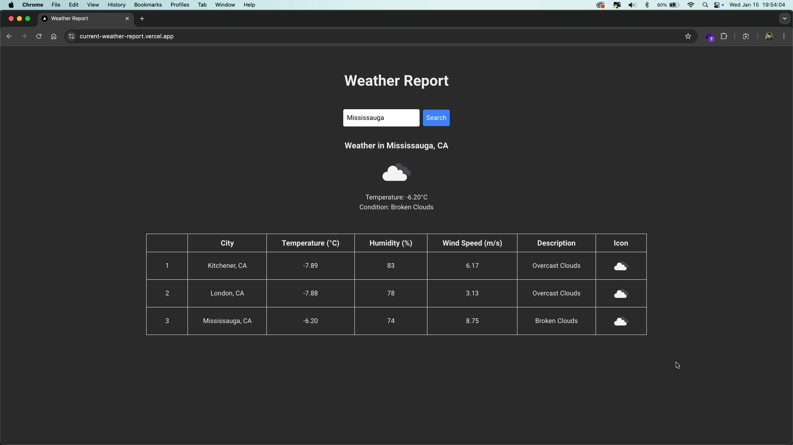

# Current Weather Report in Celsius 🌤️

A simple weather app built with Next.js and React that consumes the OpenWeather API to display the current weather in Celsius for any given city. The app allows users to enter a city and view its weather details in an appealing and user-friendly interface.

## Features ✨
- **Search for a city**: Enter the name of any city to get the current weather.
- **Weather details in Celsius**: Displays temperature and weather conditions in Celsius.
- **Modern UI**: Clean and intuitive user interface for a seamless experience.
- **Responsive**: Optimized for both desktop and mobile devices.
  
## Live Demo 🌍
You can access the live version of the app here:  
https://current-weather-report.vercel.app/

## Technologies Used 🛠️
- **Next.js**: React framework for server-side rendering.
- **React**: Library for building the user interface.
- **OpenWeather API**: Provides weather data for cities.
- **Tailwind CSS Modules**: For styling the components.
  
## Setup & Installation 🚀
To run the app locally, follow these steps:

1. Clone this repository:
   ```bash
   git clone https://github.com/nachiketdobariya/WeatherReport.git
   ```

2. Navigate to the project directory:
   ```bash
   cd weatherreport
   ```

3. Install dependencies:
   ```bash
   yarn install
   ```

4. Create a `.env.local` file in the root directory and add your OpenWeather API key:
   ```
   NEXT_PUBLIC_API_BASE_URL=https://api.openweathermap.org/data/2.5
   NEXT_PUBLIC_API_ICON_URL=https://openweathermap.org/img/wn
   NEXT_PUBLIC_OPEN_WEATHER_API_KEY=your-api-key-here
   ```

5. Run the development server:
   ```bash
   yarn dev
   ```

6. Open the app in your browser at `http://localhost:3000` or `http://10.0.0.20:3000`

## How It Works 🔍
1. **City Input**: The user enters the name of the city in the search box.
2. **Fetch Weather Data**: The app uses the OpenWeather API to fetch the current weather for the city.
3. **Display Results**: The weather details (temperature, weather conditions) are displayed in Celsius.

## Screenshots 📸

<div style="display: flex; overflow-x: auto; white-space: nowrap; gap: 10">
  
  
</div>

## Acknowledgments 🙏
- [OpenWeather](https://openweathermap.org/current) for providing the weather data API.
- [Next.js](https://nextjs.org/) for building the framework.
  
---

Feel free to modify the content, especially with your own links and specific implementation details!
